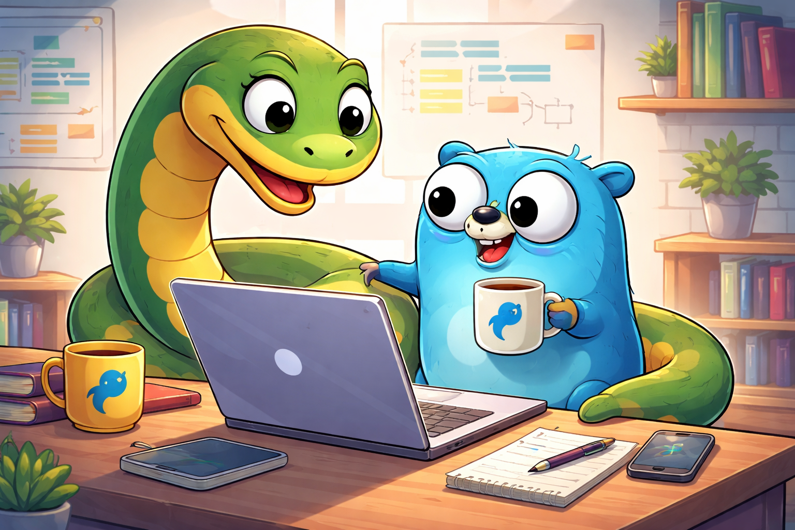
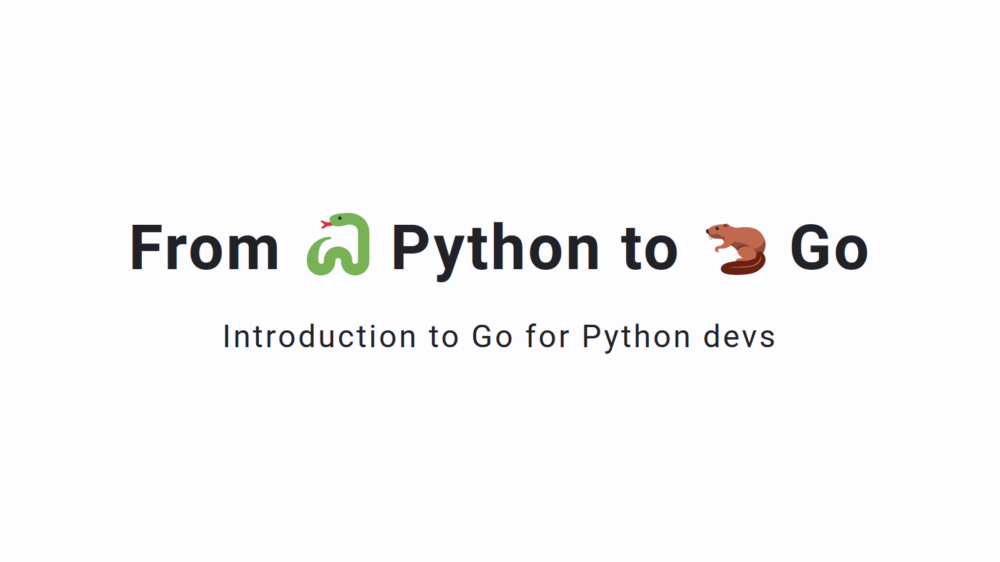

# From 🐍 Python to 🦫 Go

An introduction to Go for Python devs



## 🎞️ Slides

[](https://boisgera.github.io/python-to-go/)

## Build

Install [Node.js](https://nodejs.org) then execute the command

```
npx @marp-team/marp-cli index.md
```

to generate the `index.html` slide deck.
