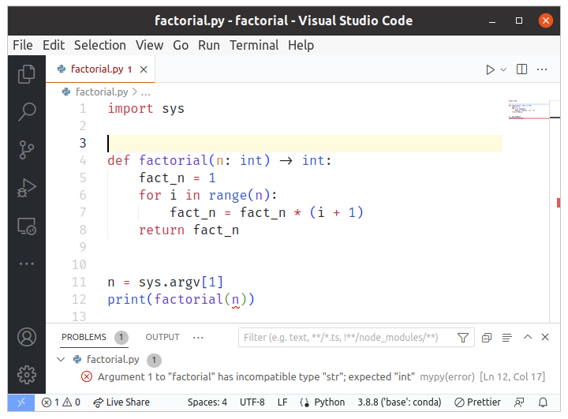

# From 🐍 Python to 🦫 Go

Introduction to Go for Python devs


---

### Selected References

  - 📖 [A Tour of Go](https://go.dev/tour/welcome/1)

  - 📖 [Go by Example](https://gobyexample.com/)

  - 📖 [The Go Programming Language Specification](https://go.dev/ref/spec)
  
---


# 🧭 Typing

##  Dynamic vs Static

---

### 🐍 The Good Old Days

```bash
$ python factorial.py 10
3628800
```

```python
# filename: factorial.py
import sys

def factorial(n):
    fact_n = 1
    for i in range(n):
        fact_n = fact_n * (i + 1)
    return fact_n

n = sys.argv[1]
print(factorial(n))
```

---

###  🪲 Ooops

The program fails at runtime:

```bash
$ python factorial.py 10
Traceback (most recent call last):
  File "/home/boisgera/tmp/r/factorial.py", line 11, in <module>
    print(factorial(n))
          ^^^^^^^^^^^^
  File "/home/boisgera/tmp/r/factorial.py", line 6, in factorial
    for i in range(n):
             ^^^^^^^^
TypeError: 'str' object cannot be interpreted as an integer
```

---

### Traceback & Program Analysis

🤔

 1. `n` should be an integer for `range(n)` to work,

 2. `factorial(n)`: same analysis,

 3. but instead `n` a string,

 4. because the elements of `sys.argv` are strings !
  
😌

---

```python
# filename: factorial.py
import sys

def factorial(n):
    fact_n = 1
    for i in range(n):
        fact_n = fact_n * (i + 1)
    return fact_n

n = sys.argv[1]  # 🪲 n should be an int
print(factorial(n))
```

---

### 🩹 Fix


```python
# filename: factorial.py
import sys

def factorial(n):
    fact_n = 1
    for i in range(n):
        fact_n = fact_n * (i + 1)
    return fact_n

n = int(sys.argv[1])  # 🩹 str -> int
print(factorial(n))
```

```bash
$ python fact.py 10
3628800
```

---

### Nowadays: Gradual Typing

The same program, with a few **type hints**:

```python
# filename: factorial.py
import sys

def factorial(n: int) -> int:
    for i in range(n):
        fact_n = fact_n * (i + 1)
    return fact_n

n = sys.argv[1]
print(factorial(n))
```

---

### Static Type Checking

in Visual Studio Code, with [mypy](https://mypy-lang.org/) enabled:




---

All types declared

```python
# filename: factorial.py
import sys

def factorial(n: int) -> int:
    i: int
    fact_n: int = 1
    for i in range(n):
        fact_n = fact_n * (i + 1)
    return fact_n

n: int = sys.argv[1]
print(factorial(n))
```

---
### 🐍

  - Python is **dynamically typed**: the same variable may refer to different types of object at different moments.

  - Developers may use (static) type hints + static type checkers to *willingly* restrict this freedom.

---
### 🦫

  - Go is **statically typed**: the type of every variable is known at compile-time.

  - Because it has been either:

    - **declared** by the developper or,

    - **inferred** by the compiler.

---

```go
var message string       // declaration
message = "Hello world!" // assignment
```

```go
var message string = "Hello world!" // combined
```

In this context, the type of message is obvious; 
we can drop the explicit type information.

```go
var message = "Hello world!"  // combined
```

---

In the body of functions (⚠️ but not at the top-level!)

```go
var message = "Hello world!"  // combined
```

can be replaced with the **short variable declaration**:

```
message := "Hello world!"
```

which *feels* like dynamical typing (but isn't 😀).
 
---

```bash
$ yaegi
> a := "Hello world!"
: Hello world!
> a = "Hello gophers! 🦫"
: Hello gophers! 🦫
> a = 42
1:32: cannot convert 42 to string
```

---

# Basic Types


| Python | Go         |
| :----- | :--------- | 
| bool     | bool       |
| int    | int        |
| float     | float64    |
| str     | string     |

---

# Do It Yourself

```
$ python -c 'print(type(42).__name__)'
int
```

```
go install github.com/traefik/yaegi/cmd/yaegi@latest
```

```
$ yaegi run -e 'reflect.TypeOf(42)'
int
```

---

# 🧭 Functions

---

## 🐍 Python

```python
from datetime import date

def getDuration(year):
    return date.today().year - self.year
```

---

## 🦫 Go

```go
import time

def getDuration(year int) int {
    return time.Now().Year() - year
}
```

---

# 🐍 Lists $\to$ 🦫 Slices

```
>>> l = [1, 2, 4]
>>> l[0]
1
>>> l.append(8)
>>> l
[1, 2, 4, 8]
>>> for n in l:
...     print(n)
... 
1
2
4
8   
```

---

```
> s := []int{1, 2, 4}
: [1 2 4]
> s[0]
: 1
> s = append(s, 8)
: [1 2 4 8]
> for n := range s { println(n) }
0
1
2
3
: [1 2 4 8]
```

---

# 🐍 Dicts $\to$ 🦫 Maps

```
>>> d = {"a": 1, "b": 2}
>>> d["a"]
1
>>> d["c"] = 3
>>> d
{'a': 1, 'b': 2, 'c': 3}
>>> for k, v in d.items():
...     print(k, v)
... 
a 1
b 2
c 3
```

---

```
> m := map[string]int{"a": 1, "b": 2}
: map[a:1 b:2]
> m["a"]
: 1
> m["c"] = 3
: 0
> m
: map[a:1 b:2 c:3]
> for k, v := range m { println(k, v) }
a 1
b 2
c 3
: map[a:1 b:2 c:3]
```
---

# 🐍 Objects $\to$ 🦫 Structs

```python
class Person:
    def __init__(self, name, year):
        self.name = name
        self.year = year

def main():
    guido = Person(name="Guido van Rossum", year=1956)
    print(guido.name)
    print(guido.year)
```

---


```go
 type Person struct {
    Name string
    Year int
}

func main() {
    rob := Person{Name: "Robert Pike", Year: 1956}
    println(rob.Name)
    println(rob.Year)
}
```

---

# 🧭 Object Methods

---

### 🐍 Python methods

```python
from datetime import date

class Person:
    def __init__(self, name, year):
        self.name = name
        self.year = year
    def Age(self):
        return date.today().year - self.year

def main():
    guido = Person(name="Guido van Rossum", year=1956)
    print(guido.name)
    print(guido.year)
    print(guido.Age())
```

---
### 🦫 Go Methods

```go
package main

import "time"

type Person struct {
    Name string
    Year int
}

func (p Person) Age() int {
    return time.Now().Year() - p.Year
}

func main() {
    rob := Person{Name: "Robert Pike", Year: 1956}
    println(rob.Name)
    println(rob.Year)
    println(rob.Age())
}
```

---

### 🦫 Go Methods (continued)

```go
...

func (p Person) SetName(name string) {
    p.Name = name
}

func (p Person) SetYear(year int) {
    p.Year = year
}

func main() {
    rob := Person{} // ℹ️ equivalent to Person{Name: "", Year: 0}
    rob.SetName("Robert Pike")
    rob.SetYear(1956)
    println(rob.Name)
    println(rob.Year)
    println(rob.Age())
}
```

---

```bash
$ go run app.go 

0
2023
```

Uhu?

---

# Assignment


What is the semantics of assignment ?

    sum = 1 + 1

  - 🧮 Evaluate the right-hand side

  - 🤨 ???

  - 💸 Profit!

---

### 🐍 Assignment in Python

Variables **refer to** a location in memory (via a **pointer**).

Assignment **rebinds** the pointer to a new location.

```python
>>> a = 1 + 1
>>> print(hex(id(a)))
0x559b96062d60
>>> a = 42
>>> print(hex(id(a)))
0x559b96063260
```

---

### 🦫 Assignment in Go

Variables store data in a fixed location:

```go
$ yaegi
> a := 1 + 1
: 2
> &a
: 0xc00003a280
> a = 42
: 42
> &a
: 0xc00003a280
```

---

We can also store content at a location

```go
> a := 1 + 1
: 2
> p := &a // address of an int
: 0xc00014d230
> reflect.TypeOf(a)
: int
> reflect.TypeOf(p)
: *int
> *p = 42
: 42
> a
: 42
```

---

### Back to the Go methods

```go
func (p *Person) SetName(name string) {
    p.Name = name
}

func (p *Person) SetYear(year int) {
    p.Year = year
}

func main() {
    rob := Person{}
    rob.SetName("Robert Pike")
    rob.SetYear(1956)
    println(rob.Name)
    println(rob.Year)
    println(rob.Age())
}
```


---


```bash
$ go run app.go 
Robert Pike
1956
67
```

# 👍

---

### 🧹 Clean-up

```bash
$ go mod init app
$ cat go.mod
module app

go 1.19
```

---

`app/person/person.go`

```go
package person

import "time"

type Person struct {
    Name string
    Year int
}

func (p *Person) SetName(name string) {
    p.Name = name
}

func (p *Person) SetYear(year int) {
    p.Year = year
}
```

---

`app.go`

```go
package main

import (
    "app/person"
    "fmt"
)

func main() {
    rob := person.Person{}
    rob.SetName("Robert Pike")
    rob.SetYear(1956)
    fmt.Println(rob.Name)
    fmt.Println(rob.Year)
    fmt.Println(rob.Age())
}
```
